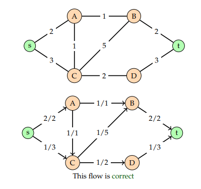
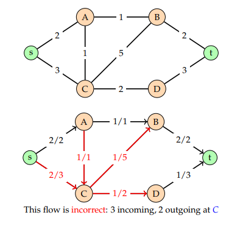
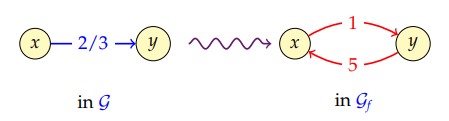
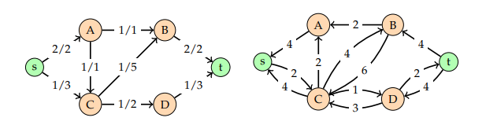
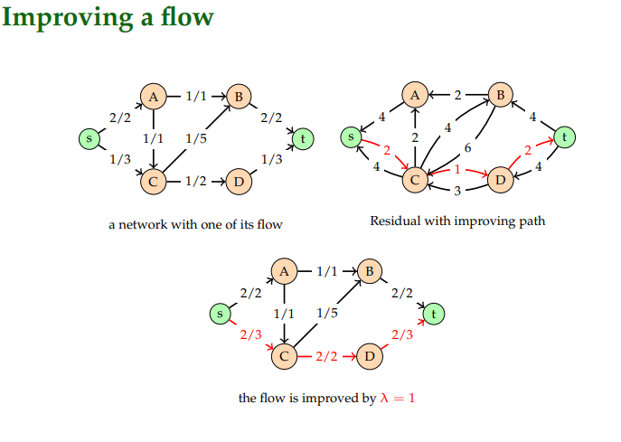
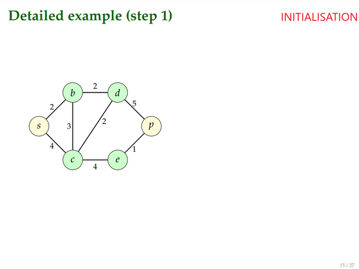

Max Flow
---
We consider connected graphs that are weighted and undirected,
with two distinguished vertices:
- the **source** usually called s
- the **sink** usually called t
  
The weights are **positive**.

Table of Content
---
- [Definitions](#definitions)
- [Flow in a graph](#flow-in-a-graph)
  - [Settings](#settings)
    - [Correct Flow](#correct-flow)
    - [Incorrect Flow](#incorrect-flow)
  - [Conditions](#conditions)
- [Ford-Fulkerson algorithm](#ford-fulkerson-algorithm)
  - [Complexity](#complexity)
  - [Residual network](#residual-network)
  - [Improving path](#improving-path)
  - [Pseudo code](#pseudo-code)
  - [Examples with steps](#examples-with-steps)
    - [Step 1](#step-1)

# Definitions
- #### Connected graph: A connected graph is graph that is connected in the sense of a topological space, i.e., there is a path from any point to any other point in the graph
- #### Undirected: An edge can be traversed in both ways
- #### Source: Starting point of the flow
- #### Sink: Ending point of the flow
- #### Network: Other name of a graph
- #### Capacity: Weight of an edge
- #### Pipes: Other name for edge
- #### Value: The value of a flow f in a graph is the quantity outgoing from s, which is equal to the quantity incoming to t
- #### Improving path: An improving path in a network is a path from s to t. Its minValue is the minimum weight of its edges.

# Flow in a graph
## Settings
- the water/data can go either way in an edge
- it cannot exceed the capacity of the edge
- except for s and t, the incoming flow must be equal to the
outgoing flow. Only outgoing from s, only incoming to t

### Correct Flow
This is a correct flow passing through the graph



### Incorrect Flow
This is an incorrect flow passing through the graph



## Conditions
Let $C(x—y)$ denote the capacity of the edge $x—y$:

- ***Antisymmetry:*** $f(x → y) = −f(y → x)$: Meaning that a flow going from x to y with flow of 3, means there is a negative flow of -3 going from y to x;
- ***Capacity:*** $−C(x – y) ≤ f(x → y) ≤ C(x – y)$: By the previous conditions ;
- ***flow conservation:*** $\Sigma y∈V f(x → y) = 0$, for $x \neq s$ and $x \neq t$.
- Outgoing flow are **positive**, and incoming ones are **negative**


# Ford-Fulkerson algorithm
The Ford-Fulkerson algorithm allow to find the maximal flow in a network.
Take note that there may be one solution among many others. The result is not always the same.

## Complexity
The complexity is hard to express as it depends on the result and on the [minValue](#improving-path-an-improving-path-in-a-network-is-a-path-from-s-to-t-its-minvalue-is-the-minimum-weight-of-its-edges)

## Residual network
The residual network of a network allows a different representation of the flow, it depict to us how the flow can be directed to find augmented path.

With an edge x—y, you can materialize the residual graph by creating 2 edges with their own weight
- x→y: weight = C(x—y) - f(<span style="color:aquamarine">**x→y**</span>)
- y→x: weight = C(x—y) - f(<span style="color:red">**y→x**</span>)



- The flow $x—y$ weight  <span style="color:aquamarine">**2**</span> is changed to <span style="color:red">**1**</span>. It represent the flow that can pass through x to y
  - $f(x → y) = 2 ⇒ x — 1 → y, as  C(x – y) − f(x → y) = 3 − 2 = 1$
- The flow $y—x$ weight <span style="color:aquamarine">**-2**</span> is changed to <span style="color:red">**5**</span>. It represent the flow that can pass through y to x as you can remove 2 from the actual flow going from x to y and add 3 
  - $f(y → x) = −2 ⇒ y — 5 → x, as  C(y – x) − f(y → x) = 3 − (−2) = 5$

Example:



## [Improving path](#improving-path-an-improving-path-in-a-network-is-a-path-from-s-to-t-its-minvalue-is-the-minimum-weight-of-its-edges)
Let Gf be the residual network associated to the flow f

2 Theorems:
- If there is no improving path, then f is a maximum flow
- If there is an improving path P of [minValue](#improving-path-an-improving-path-in-a-network-is-a-path-from-s-to-t-its-minvalue-is-the-minimum-weight-of-its-edges) λ, then adding λ to every edge of P results in a flow, whose value is increased by λ

Example:



## Pseudo code
```py
def FordFulkerson(G, s, p):
    f = null flow (0 for all edge)
    while there is an improving path do :
        P = improving path of Gf
        λ = minvalue of P
        update f by adding λ on edges in P
    return f
```

## Examples with steps

### Step 1



